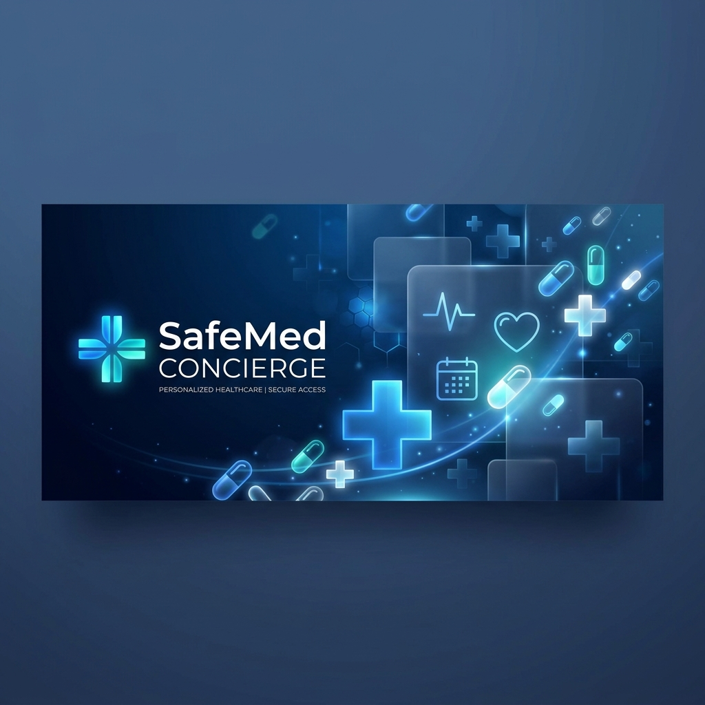

# 🩺 SafeMed Concierge - Smart Medication Safety Agent

A comprehensive AI-powered medication management and drug safety platform that prevents dangerous drug-drug interactions, optimizes dosing schedules, and provides intelligent medication guidance using Google's Gemini AI and Model Context Protocol (MCP).



---

## 📋 Problem Statement

**The Challenge:**
Medication errors and dangerous drug-drug interactions remain a significant healthcare problem:
- ~125,000 deaths annually in the US due to medication non-compliance (CDC)
- Patients often don't know about critical interactions between their medications
- Complex medication schedules lead to missed doses and poor adherence
- Manual tracking of dosing times is error-prone and time-consuming

**The Solution:**
SafeMed Concierge leverages cutting-edge AI and a comprehensive drug interaction database to:
- ✅ **Detect dangerous interactions** in real-time using FDA data
- ✅ **Generate optimized schedules** that prevent absorption conflicts
- ✅ **Provide intelligent guidance** via an AI chat interface
- ✅ **Protect patient privacy** with automatic PII masking
- ✅ **Ensure medical safety** with built-in disclaimers and reference-based checking

---

## 🎯 Solution Overview

### Key Features

#### 1. **Drug Interaction Safety Board**
- Real-time detection of critical drug-drug interactions
- Color-coded severity levels: 🚨 Critical, ⚠️ High, ⚠️ Medium, ✅ Safe
- Displays clinical explanations and risk assessments
- Pulls from local high-risk interaction database and live FDA API

#### 2. **Optimized Daily Dosing Schedule**
- Intelligent timeline generation (Morning → Afternoon → Evening → Night)
- Prevents scheduling conflicts (e.g., Ciprofloxacin + Calcium separation)
- Exportable to text format for printing or sharing with healthcare providers
- Visual compliance tracking with checkboxes

#### 3. **SafeMed AI Chat**
- Context-aware medication counseling
- Powered by **Gemini 2.5 Flash** (with fallback to local simulation)
- Delegates queries to specialized agents:
  - **Safety Agent**: Drug interaction checks & FDA warnings
  - **Dosage Agent**: Schedule optimization & timing guidance
  - **Triage Agent**: Primary concierge coordination

#### 4. **Quick Interaction Testing**
- Pre-loaded dangerous drug pairs for instant testing
- Examples: Warfarin + Aspirin, Sildenafil + Nitroglycerin
- One-click testing for demonstration and education

#### 5. **Privacy & Security**
- Automatic PII masking (names, SSNs, dates, phone numbers)
- Medical disclaimer enforcement
- Session-based patient tracking
- HIPAA-friendly architecture

---

## 🏗️ Architecture

### System Components

```
┌─────────────────────────────────────────────────────────┐
│           Streamlit Web Application (app.py)            │
│  ┌──────────────┐  ┌──────────────┐  ┌──────────────┐  │
│  │   Sidebar    │  │ Medication   │  │   AI Chat    │  │
│  │  (Controls)  │  │  Log & Time  │  │  Interface   │  │
│  └──────────────┘  └──────────────┘  └──────────────┘  │
│  ┌──────────────────────────────────────────────────┐   │
│  │   Drug Interaction Safety Board (Real-time)      │   │
│  │   Optimized Daily Calendar (Export-ready)        │   │
│  └──────────────────────────────────────────────────┘   │
└──────────────┬──────────────────────────────────────────┘
               │
        ┌──────▼──────────────────────────────────┐
        │   Agent Coordination Layer (adk_agents) │
        │  ┌────────────────────────────────────┐ │
        │  │  Google ADK Framework               │ │
        │  │  ┌──────────────────────────────┐ │ │
        │  │  │ Triage Agent (Primary)       │ │ │
        │  │  │ ├─ Safety Agent              │ │ │
        │  │  │ └─ Dosage Agent              │ │ │
        │  │  └──────────────────────────────┘ │ │
        │  └────────────────────────────────────┘ │
        └──────────┬──────────────────────────────┘
                   │
        ┌──────────▼────────────────────────────┐
        │  Model Context Protocol (mcp_server)  │
        │  ┌────────────────────────────────┐  │
        │  │ MCP Tools:                     │  │
        │  │ • check_local_interactions()   │  │
        │  │ • search_fda_drug_label()      │  │
        │  │ • generate_dosage_schedule()   │  │
        │  └────────────────────────────────┘  │
        └──────────┬────────────────────────────┘
                   │
        ┌──────────┴──────────────┬──────────────┐
        │                         │              │
    ┌───▼────┐          ┌────────▼───┐    ┌────▼───┐
    │ Local  │          │ Gemini     │    │ FDA    │
    │ Interact.│          │ 2.5 Flash  │    │ API    │
    │ DB     │          │ LLM        │    │(Live)  │
    │(JSON)  │          │            │    │        │
    └────────┘          └────────────┘    └────────┘
```

### Data Flow

1. **User Input** → Streamlit app
2. **Query Processing** → PII masking via `security.py`
3. **Agent Routing** → Triage agent selects appropriate specialist
4. **Tool Execution** → MCP server calls appropriate function
5. **Data Retrieval** → Local DB or FDA API
6. **Response Generation** → Gemini LLM (or mock fallback)
7. **Safety Enforcement** → Disclaimer injection & response validation
8. **Display** → Streamlit renders styled components

---

## 📁 Project Structure

```
kaggle-CapstoneProject/
├── app.py                      # Main Streamlit application (30KB)
│                               # - UI/UX with custom CSS styling
│                               # - Chat interface & medication management
│                               # - Safety board rendering
│
├── adk_agents.py              # Google ADK Agent Framework (10KB)
│                               # - Triage, Safety, Dosage agents
│                               # - MockLlm fallback implementation
│                               # - PII masking integration
│
├── mcp_server.py              # Model Context Protocol Server (9KB)
│                               # - check_local_interactions()
│                               # - search_fda_drug_label() (OpenFDA API)
│                               # - generate_dosage_schedule()
│
├── security.py                # Security & Privacy Module (4KB)
│                               # - PII masking functions
│                               # - Medical disclaimer enforcement
│
├── data/                       # Data directory
│   └── interactions_db.json   # Local drug interaction database
│
├── tests/                      # Test suite (placeholder)
│
├── header.png                 # Application header image
├── .gitignore                 # Git ignore rules
└── README.md                  # This file
```

---

## 🛠️ Setup Instructions

### Prerequisites

- **Python 3.10+**
- **pip** or **conda** package manager
- **Google Gemini API Key** (optional, but recommended)
- ~500MB disk space for dependencies

### Installation

#### 1. Clone the Repository

```bash
git clone https://github.com/vesecikaaqii/kaggle-CapstoneProject.git
cd kaggle-CapstoneProject
```

#### 2. Create Virtual Environment

```bash
# Using venv
python -m venv venv
source venv/bin/activate  # On Windows: venv\Scripts\activate

# Or using conda
conda create -n safemed python=3.10
conda activate safemed
```

#### 3. Install Dependencies

```bash
pip install -r requirements.txt
```

Key dependencies:
```
streamlit>=1.28.0
google-generativeai>=0.3.0
google-adk>=0.1.0
mcp>=0.1.0
httpx>=0.25.0
```

#### 4. Set Up Environment Variables (Optional)

For Gemini AI integration:

```bash
# Create .env file
echo "GEMINI_API_KEY=your_api_key_here" > .env

# Or set environment variable
export GEMINI_API_KEY="your_api_key_here"
```

Get your API key from [Google AI Studio](https://aistudio.google.com)

#### 5. Prepare Data

Ensure the local database exists:

```bash
mkdir -p data
# interactions_db.json should be present with drug interaction records
```

#### 6. Run the Application

```bash
streamlit run app.py
```

The app will open at `http://localhost:8501`

### Configuration

**Environment Variables:**
- `GEMINI_API_KEY` or `GOOGLE_API_KEY`: Gemini API authentication
- `LOG_LEVEL`: Set to DEBUG for verbose logging

**Application Settings (in `app.py`):**
- `page_title`: "SafeMed Concierge - Smart Medication Safety Agent"
- `page_icon`: "🩺"
- `layout`: "wide"
- Session states manage medications, chat history, and user IDs

---

## 💊 Example Usage

### Scenario 1: Check Drug Interaction

1. **Sidebar**: Select "🚨 Warfarin + Aspirin" quick test button
2. **Safety Board** automatically shows:
   - 🚨 **HIGH RISK** warning with clinical explanation
   - Risk of severe internal bleeding
3. **Chat**: Ask "Why is this dangerous?" → AI explains mechanism
4. **Schedule**: View optimized dosing timeline

### Scenario 2: Add Multiple Medications

1. **Medication Log**: Click "➕ Add Medication"
2. **Manual Entry Tab**:
   - Name: "Lisinopril"
   - Dose: "10mg"
   - Frequency: "Once daily"
3. **Repeat** for additional medications
4. **Safety Board** updates in real-time
5. **Generate Schedule**: Click "🔄 Generate Daily Timeline"
6. **Export**: Download as `safemed_schedule.txt`

### Scenario 3: FDA Drug Lookup

1. **Chat**: Type "What are FDA warnings for Simvastatin?"
2. **Safety Agent** executes:
   - Query openFDA API for drug label
   - Returns official warnings, contraindications, interactions
3. **Display**: Formatted clinical information

---

## 🔐 Safety & Privacy Features

### PII Masking
Automatically redacts sensitive information:
- Names → [NAME]
- SSNs → [SSN]
- Dates → [DATE]
- Phone numbers → [PHONE]

### Medical Disclaimer
Enforced on all AI responses:
```
🔬 Medical Disclaimer: This tool provides educational information only 
and should NOT replace professional medical advice. Always consult your 
healthcare provider before making medication changes.
```

### Data Security
- Session-based patient tracking
- No persistent data storage (in-memory sessions)
- API key isolation via environment variables

---

## 📊 Drug Interaction Database

### Local Database Format (`data/interactions_db.json`)

```json
{
  "interactions": [
    {
      "drug_a": "Warfarin",
      "drug_b": "Aspirin",
      "severity": "High",
      "risk": "Severe internal bleeding",
      "description": "Combining anticoagulant with antiplatelet increases bleeding risk..."
    },
    {
      "drug_a": "Sildenafil",
      "drug_b": "Nitroglycerin",
      "severity": "Critical",
      "risk": "Sudden severe hypotension",
      "description": "Can cause life-threatening blood pressure drop..."
    }
  ]
}
```

### FDA API Integration

- **Endpoint**: `https://api.fda.gov/drug/label.json`
- **Data**: Official FDA drug labels with:
  - General warnings
  - Drug interactions
  - Contraindications
  - Boxed warnings

---

## 🤖 AI Agent Architecture

### Agent Hierarchy

```
Triage Agent (Primary Coordinator)
├─ Instruction: Greet user, route queries intelligently
├─ Sub-agents:
│  ├─ Safety Agent
│  │  └─ Tools: check_local_interactions, search_fda_drug_label
│  └─ Dosage Agent
│     └─ Tools: generate_dosage_schedule
└─ Model: Gemini 2.5 Flash (or MockLlm fallback)
```

### Agent Behavior

**Safety Agent:**
- Detects high-risk interactions from local database
- Queries FDA API for official warnings
- Explains clinical implications in patient-friendly language

**Dosage Agent:**
- Generates conflict-free schedules
- Respects absorption timing (e.g., Ciprofloxacin ≠ Calcium)
- Produces exportable daily timelines

**Triage Agent:**
- Welcomes user warmly
- Analyzes query intent
- Delegates to appropriate specialist
- Maintains consistent professional tone

---

## 🎨 User Interface Highlights

### Design System
- **Dark theme** with blue accents (#0369a1, #0891b2)
- **Glass morphism** cards with backdrop blur
- **Color-coded alerts**: 🚨 Red (Critical), 🟠 Orange (High), 🟡 Yellow (Medium), ✅ Green (Safe)
- **Responsive layout**: Two-column design adapts to screen size
- **Custom fonts**: Inter (UI) + JetBrains Mono (code)

### Key UI Components
- **Header Banner**: Application title + status pills
- **Medication Log**: Add/delete with visual cards
- **Safety Board**: Real-time interaction alerts
- **Calendar Timeline**: Morning → Afternoon → Evening → Night slots
- **Chat Interface**: Scrollable message history
- **Compliance Tracker**: Checkboxes for dose logging
- **Export Button**: Download schedules as .txt

---

## 🧪 Testing

### Quick Tests Included

Pre-configured dangerous drug pairs for instant demonstration:
1. 🚨 Warfarin + Aspirin → Bleeding risk
2. 🚨 Sildenafil + Nitroglycerin → Hypotension
3. 🚨 Phenelzine + Sertraline → Serotonin syndrome
4. ⚠️ Lisinopril + Spironolactone → Hyperkalemia
5. ⚠️ Simvastatin + Amlodipine → Statin toxicity
6. ⚠️ Ciprofloxacin + Calcium → Absorption conflict

**To test:** Click any button in the sidebar to load the drug pair and see instant safety analysis.

### Manual Testing

```bash
# 1. Start the app
streamlit run app.py

# 2. Add medications manually
# 3. Chat with AI: "Check for interactions"
# 4. Generate and export schedule
# 5. Verify FDA lookups work
```

### Fallback Testing (Without Gemini Key)

The MockLlm provides deterministic responses for testing without API keys.

---

## 📈 Performance & Scalability

| Metric | Specification |
|--------|---------------|
| **Chat Response Time** | < 2s (Gemini), < 500ms (Mock) |
| **Schedule Generation** | < 1s for 10+ medications |
| **Interaction Check** | < 100ms (local DB) |
| **FDA API Lookup** | 2-5s (network dependent) |
| **Concurrent Users** | 1 (single Streamlit session) |
| **Data Storage** | In-memory (no persistence) |

---

## 🚀 Future Enhancements

### Phase 2 Features
- [ ] Multi-user support with database persistence
- [ ] Patient profile history & medication archives
- [ ] Integration with pharmacy APIs
- [ ] Prescription image OCR with ML
- [ ] Mobile app (React Native)
- [ ] SMS reminders & compliance alerts
- [ ] Integration with EHR systems
- [ ] Natural language processing for prescription parsing

### Advanced Features
- [ ] Personalized interaction risk scoring
- [ ] Kidney/liver function dose adjustments
- [ ] Drug allergy detection
- [ ] Insurance coverage verification
- [ ] Generic alternative suggestions
- [ ] Real-time medication cost comparison

---

## 📚 References & Data Sources

### APIs & Databases
- **OpenFDA API**: https://open.fda.gov/apis/drug/label/
- **Google Gemini API**: https://ai.google.dev
- **Model Context Protocol (MCP)**: https://modelcontextprotocol.io

### Clinical References
- FDA Official Drug Labels & Warnings
- High-risk drug interaction literature
- Clinical pharmacology databases

### Technology Stack
- **Frontend**: Streamlit (Python web framework)
- **AI/LLM**: Google Gemini 2.5 Flash
- **Agent Framework**: Google ADK (Agent Development Kit)
- **Tool Protocol**: Model Context Protocol (MCP)
- **API Client**: httpx (async HTTP)
- **Data Format**: JSON (local database)

---

## ⚖️ Legal & Medical Disclaimer

**⚠️ IMPORTANT: READ BEFORE USE**

SafeMed Concierge is an **educational tool only** and should **NOT** be used as a substitute for professional medical advice, diagnosis, or treatment. 

- Always consult with a licensed healthcare provider before making any medication decisions
- This system is not FDA-approved for clinical use
- Do not self-diagnose or self-prescribe based on this tool's output
- In case of medical emergency, call 911 or your local emergency services immediately
- Interactions shown may not be complete; newer drugs may not be in the database

**Use at your own risk.** The creators assume no liability for misuse or adverse outcomes.

---

## 👨‍💻 Developer Information

### Author
**vesecikaaqii** - Capstone Project Submission

### Technologies Used
- Python 3.10+
- Streamlit 1.28+
- Google ADK (Agent Development Kit)
- Model Context Protocol (MCP)
- Google Generative AI (Gemini)
- OpenFDA API

### Contact & Support
For issues, questions, or feature requests, please open a GitHub issue.

---

## 📄 License

This project is provided as-is for educational purposes. See repository for license details.

---

## 🎓 Acknowledgments

- Google ADK team for agent framework
- OpenFDA for public drug label data
- Streamlit for web application framework
- Clinical pharmacology community for safety data

---

**Made with ❤️ for medication safety**

*SafeMed Concierge - Preventing dangerous drug interactions, one patient at a time.*
